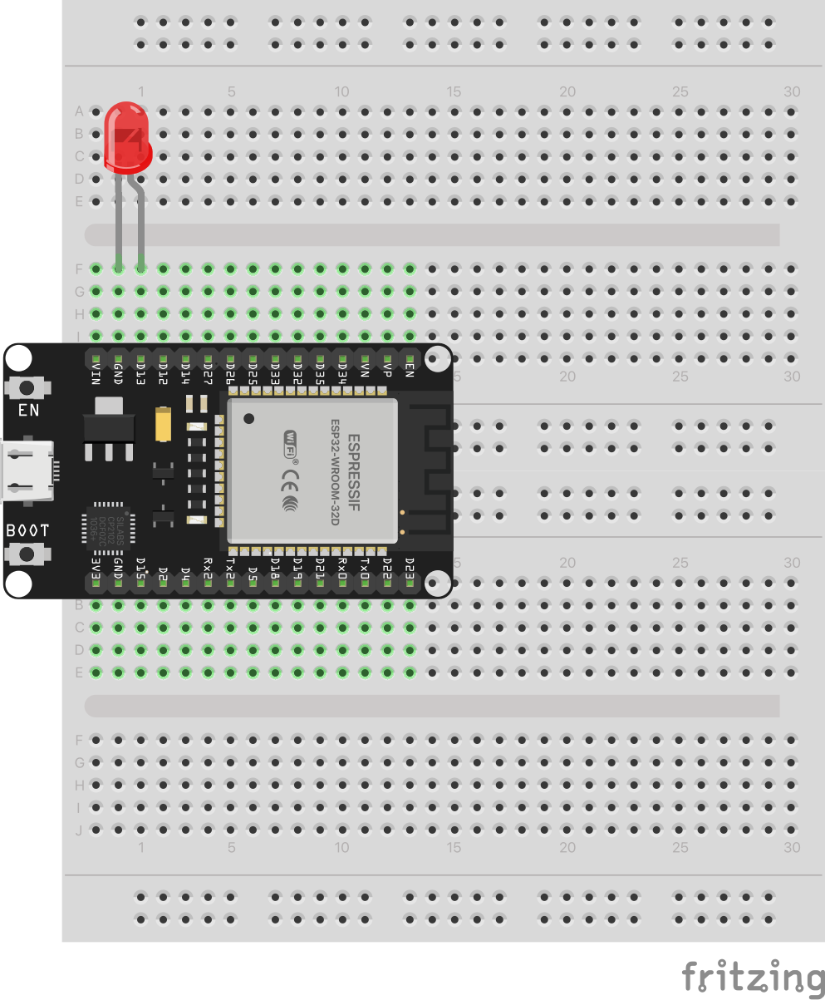

# Blink Builtin LED

The classic "Hello World" of embedded programming. Blinks the ESP32's built-in LED to verify programming workflow without external components.

## Schematic

**Note:** The schematic shows an external LED on GPIO 13. The default code uses the built-in LED on GPIO 2 (no wiring required). To use the external LED as shown, change `LED_PIN` from `2` to `13` in the code.

## Hardware Required

**For built-in LED (default):**
- ESP32 development board (any model with onboard LED)
- USB cable

**For external LED (as shown in schematic):**
- ESP32 development board
- LED (any color)
- 220Ω resistor
- Breadboard and jumper wires
- USB cable

## Pin Connections

| Component | ESP32 Pin | Notes |
|-----------|-----------|-------|
| Built-in LED | GPIO 2 | Default, no wiring |
| External LED (+) | GPIO 13 | Change `LED_PIN = 13` in code |
| External LED (-) | GND | Via 220Ω resistor |

## Usage

### Arduino IDE
1. Open `arduino/blink/blink.ino`
2. Select board: ESP32 Dev Module
3. Upload

### PlatformIO
1. Open `platformio/` folder
2. Build and upload

## Expected Behavior

The built-in LED blinks with a 1-second on/off rhythm. LED turns on for 1 second, then off for 1 second, continuously.
