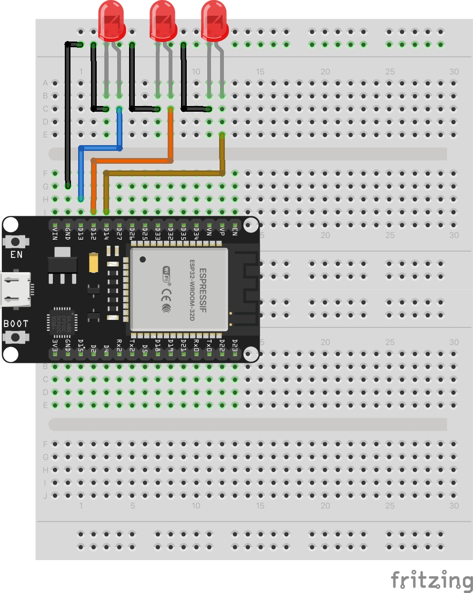

# Blink Multiple LEDs

Controls three LEDs independently to create sequential lighting patterns. Demonstrates coordinated output control and timing.

## Schematic

## Hardware Required

- ESP32 development board
- Breadboard
- 3x LEDs (different colors recommended)
- 3x 220-330Ω resistors
- Jumper wires
- USB cable

## Pin Connections

| Component | ESP32 Pin |
|-----------|-----------|
| LED 1 (via resistor) | GPIO 13 |
| LED 2 (via resistor) | GPIO 14 |
| LED 3 (via resistor) | GPIO 12 |
| All LED cathodes | GND |

## Usage

### Arduino IDE
1. Open `arduino/blink-multiple/blink-multiple.ino`
2. Select board: ESP32 Dev Module
3. Upload

### PlatformIO
1. Open `platformio/` folder
2. Build and upload

## Expected Behavior

Three LEDs create a ping-pong/sweep effect: LEDs turn on sequentially (1-2-3) with 200ms delays, then turn off in reverse order (3-2-1). Pattern repeats continuously.

The code includes commented examples for simultaneous blinking and simple sequential patterns.
