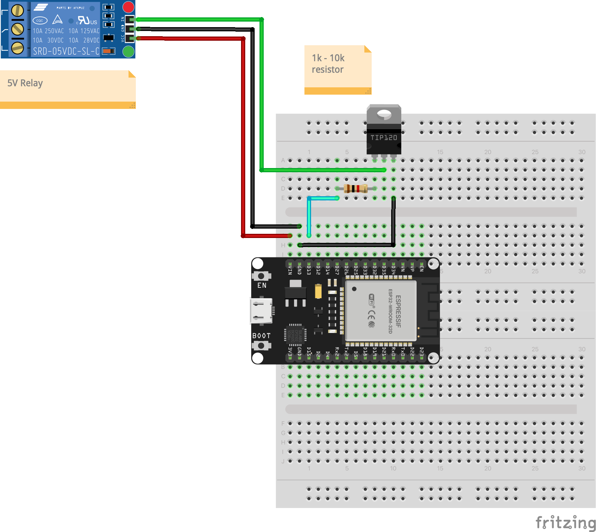

# Relay Control

Controls a 5V relay module through transistor interface. Introduces voltage level conversion, transistor switching, and high-power load control principles.

## Schematic

## Hardware Required

- ESP32 development board
- 5V relay module (or discrete relay + transistor circuit)
- TIP120 transistor (or equivalent NPN/MOSFET)
- 1kΩ resistor (for transistor base)
- Flyback diode (1N4007 or similar)
- 5V power supply (can use USB 5V)
- Breadboard and jumper wires

## Pin Connections

| Component | ESP32 Pin |
|-----------|-----------|
| Transistor base (via 1kΩ) | GPIO 13 |
| All grounds (ESP32, 5V, relay) | Common GND |

## Usage

### Arduino IDE
1. Open `arduino/relay/relay.ino`
2. Select board: ESP32 Dev Module
3. Upload

### PlatformIO
1. Open `platformio/` folder
2. Build and upload

## Expected Behavior

The relay clicks on and off with a 500ms rhythm. You can hear the mechanical relay switching. Relay energizes for 500ms, then de-energizes for 500ms, continuously.

**WARNING**: This exercise uses only low-voltage DC. Never connect relays to mains/AC power without qualified supervision.
