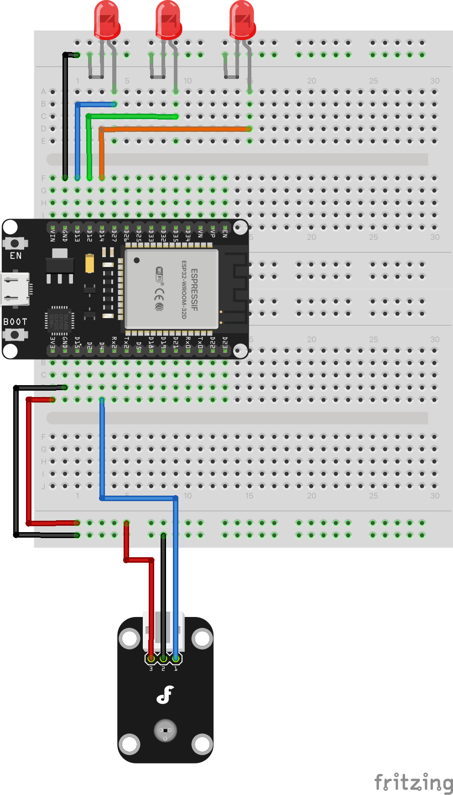

# LDR Controls LEDs (Threshold-Based Control)

Use a photoresistor (LDR) to control 3 LEDs based on light levels, demonstrating threshold-based logic and visual feedback for analog sensor data.

## Schematic

## Hardware Required

- ESP32-WROOM-32 development board
- Photoresistor module (LDR) (DFRobot, 3-pin: VCC/Signal/GND)
- 3x LEDs (any color)
- 3x resistors (220-330Ω for LED current limiting)
- Jumper wires
- USB cable

## Pin Connections

| Component | ESP32 Pin |
|-----------|-----------|
| LDR Signal | GPIO 4 |
| LDR VCC | 3.3V |
| LDR GND | GND |
| LED1 (Medium level) | GPIO 13 |
| LED2 (High level) | GPIO 12 |
| LED3 (Very high level) | GPIO 14 |

## Usage

### Arduino IDE
1. Open `arduino/ldr-leds/ldr-leds.ino`
2. Select board: ESP32 Dev Module
3. Upload and open Serial Monitor at 115200 baud

### PlatformIO
1. Open `platformio/` folder
2. Build and upload

## Expected Behavior

LEDs illuminate based on light sensor readings:
- 0-1000: 0 LEDs (low light)
- 1001-2800: 1 LED (medium light)
- 2801-4000: 2 LEDs (high light)
- 4001+: 3 LEDs (very high light)

Serial Monitor displays real-time ADC values (0-4095) at 10 samples per second. Cover the sensor or shine light on it to see LED changes.
