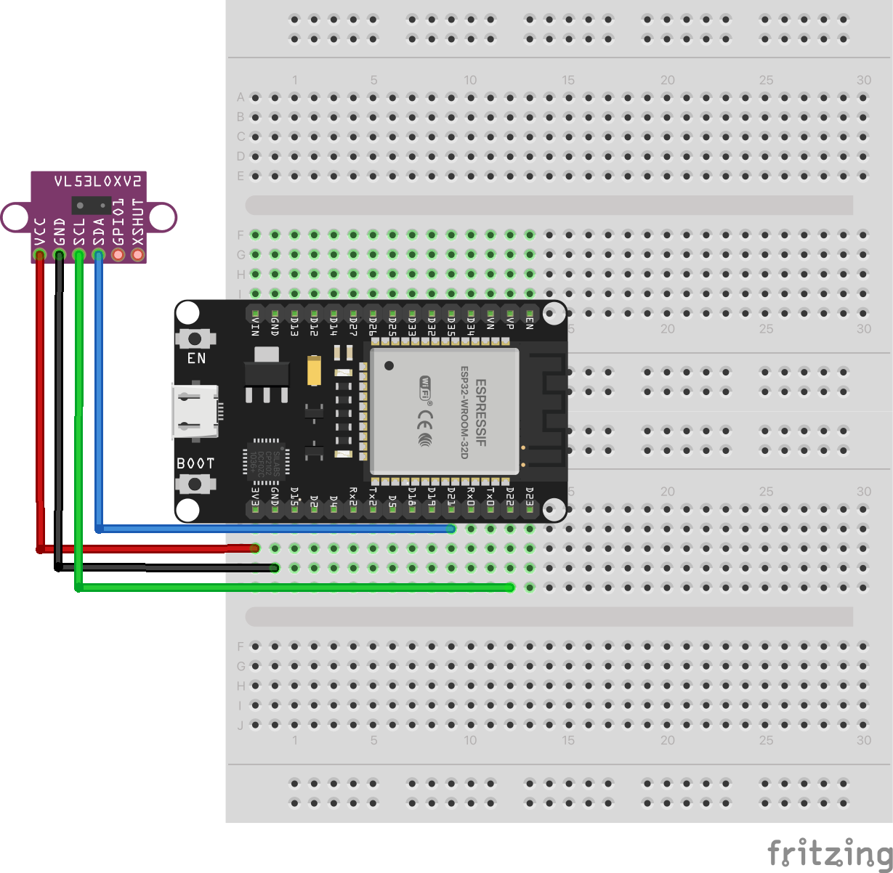

# ToF Distance Sensor (VL53L0X I2C)

Read distance measurements from the VL53L0X Time-of-Flight sensor using I2C communication protocol.

## Schematic

## Hardware Required

- ESP32-WROOM-32 development board
- VL53L0X ToF sensor (Time-of-Flight distance sensor)
- 4x jumper wires (VCC, GND, SDA, SCL)
- USB cable

## Pin Connections

| Component | ESP32 Pin |
|-----------|-----------|
| VL53L0X SDA | GPIO 21 |
| VL53L0X SCL | GPIO 22 |
| VL53L0X VIN | 3.3V |
| VL53L0X GND | GND |

## Usage

### Arduino IDE
1. Install library: Adafruit_VL53L0X (via Library Manager)
2. Open `arduino/tof-sensor/tof-sensor.ino`
3. Select board: ESP32 Dev Module
4. Upload and open Serial Monitor at 115200 baud

### PlatformIO
1. Open `platformio/` folder
2. Build and upload (library auto-installed via platformio.ini)

## Expected Behavior

Serial Monitor displays distance measurements in millimeters at 10 samples per second. Effective range: 30-1200mm. Move your hand or objects in front of the sensor to see distance values change in real-time.
