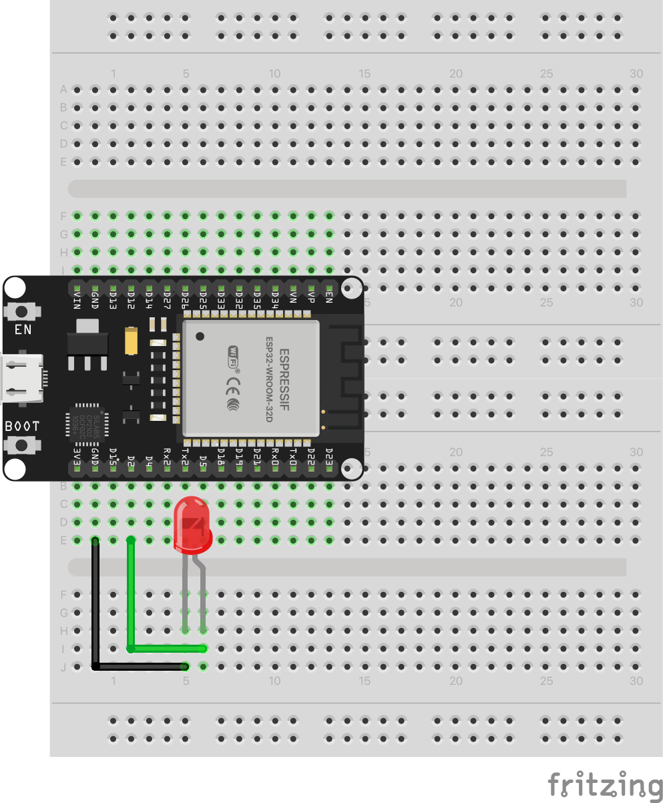

# MQTT with Analog Sensors

Transmitting continuous analog sensor data over MQTT. One ESP32 reads a photoresistor (LDR) and publishes light level values to MQTT broker, another ESP32 subscribes and controls LED brightness or on/off state based on threshold.

## Schematic

## Hardware Required

**Publisher ESP32:**
- ESP32-WROOM-32
- Photoresistor (LDR)
- 10kΩ resistor (voltage divider)
- Jumper wires
- WiFi network access
- USB cable

**Subscriber ESP32:**
- ESP32-WROOM-32
- LED
- 220Ω resistor
- Jumper wires
- WiFi network access
- USB cable

## Pin Connections

**Publisher (Photoresistor):**

| Component | ESP32 Pin |
|-----------|-----------|
| LDR (one side) | 3.3V |
| LDR (other side) | GPIO 34 |
| 10kΩ resistor | GPIO 34 to GND |

**Subscriber (LED):**

| Component | ESP32 Pin |
|-----------|-----------|
| LED Anode (+) | GPIO 2 |
| LED Cathode (-) | GND (via 220Ω resistor) |

## Usage

### Arduino IDE

**Publisher:**
1. Open `arduino/sender/sender.ino`
2. Modify `WIFI_SSID`, `WIFI_PASSWORD`, and `MQTT_PUBLISH_TOPIC` (use unique topic name)
3. Install PubSubClient library (Sketch > Include Library > Manage Libraries)
4. Select board: ESP32 Dev Module
5. Upload

**Subscriber:**
1. Open `arduino/receiver/receiver.ino`
2. Modify `WIFI_SSID`, `WIFI_PASSWORD`, and `MQTT_SUBSCRIBE_TOPIC` (must match publisher)
3. Install PubSubClient library
4. Select board: ESP32 Dev Module
5. Upload

### PlatformIO

**Publisher:**
1. Open `platformio-sender/` folder
2. Modify WiFi and MQTT settings in `src/main.cpp`
3. Build and upload

**Subscriber:**
1. Open `platformio-receiver/` folder
2. Modify WiFi and MQTT settings in `src/main.cpp`
3. Build and upload

## Expected Behavior

**Publisher:** Connects to WiFi and MQTT broker (broker.hivemq.com), reads photoresistor value (0-4095), publishes analog value to topic every 500ms. Cover/uncover photoresistor to see value changes in Serial Monitor.

**Subscriber:** Connects to WiFi and MQTT broker, subscribes to topic, turns LED ON when received value > 2000 (bright light detected), OFF when value < 2000 (dark). Threshold configurable in code.

**Important:** Change `MQTT_PUBLISH_TOPIC` to unique name (e.g., "students/yourname/light") to avoid conflicts with other users on public broker.
